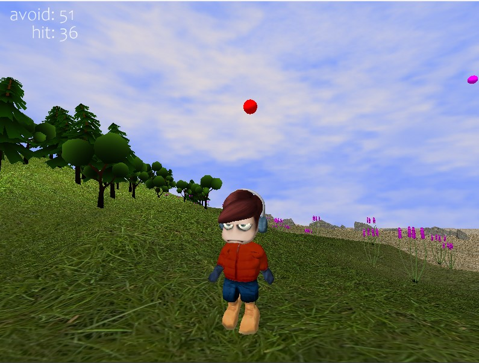
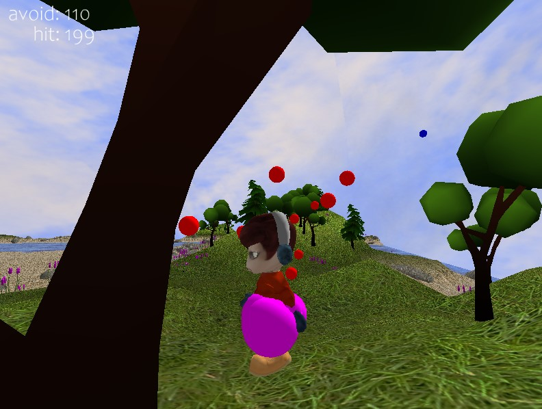

# Panda3D Simulation Environment

> A real-time 3D simulation environment built with **Panda3D** and **Python**, demonstrating terrain generation, dynamic obstacle simulation, collision detection, and modular simulation architecture.



---

## Overview

Panda3D Simulation Environment is a real-time interactive 3D application developed with **Python** and **Panda3D**. The project demonstrates the design and implementation of a modular simulation environment featuring dynamic obstacle generation, heightmap-based terrain rendering, collision detection, third-person character control, and event-driven gameplay systems.

Although presented as an interactive game, the underlying architecture follows many of the same engineering principles used when building simulation environments for AI training, robotics research, and autonomous agent development.

This project highlights practical experience with Panda3D's rendering pipeline, scene graph management, collision system, terrain generation, and real-time simulation loop.

---

## Screenshots

### Interactive 3D Simulation


### Dynamic Obstacle Simulation



---

# Features

- Real-time 3D simulation built with Panda3D
- Heightmap-based terrain generation
- Dynamic obstacle spawning
- Third-person character controller
- Collision detection and response
- Score and statistics tracking
- Procedural environment loading
- Modular object-oriented architecture
- Cross-platform desktop application

---

# Technology Stack

| Technology | Purpose |
|------------|---------|
| Python 3 | Core application development |
| Panda3D | Rendering engine and simulation framework |
| OpenCV | Heightmap processing |
| NumPy | Numerical operations |
| Pillow | Image processing |

---

# Project Architecture

```
Application
│
├── Main Simulation Loop
│
├── Terrain System
│   ├── Heightmap Loader
│   ├── Texture Mapping
│   ├── Environment Generation
│   └── Terrain Queries
│
├── Player Controller
│
├── Dynamic Ball System
│
├── Collision Manager
│
├── Camera Controller
│
├── UI / Statistics
│
└── Asset Management
```

The project is organized into independent modules, allowing individual systems to evolve without introducing unnecessary coupling. This modular architecture simplifies maintenance and future expansion.

---

# Core Components

## Terrain System

The environment is generated from terrain heightmaps, allowing different landscape regions to be loaded dynamically.

Responsibilities include:

- Heightmap loading
- Terrain mesh generation
- Texture application
- Height queries
- Terrain management

---

## Player Controller

The player controller handles:

- Keyboard input
- Character movement
- Animation
- Ground alignment
- Collision responses

---

## Dynamic Obstacle Simulation

Obstacle objects are continuously spawned into the environment.

Each simulation object manages:

- Spawn location
- Movement
- Lifetime
- Collision events
- Cleanup

This architecture allows additional simulation entities to be introduced with minimal changes to the existing codebase.

---

## Collision Detection

The simulation uses Panda3D's collision framework to detect interactions between the player and dynamic obstacles.

Features include:

- Collision callbacks
- Hit detection
- Score updates
- Event-driven gameplay logic

---

## Camera System

A smooth third-person camera follows the player while maintaining an optimal viewing angle throughout the simulation.

---

# Performance Considerations

Several design decisions were made to improve runtime performance:

- Modular scene organization
- Efficient use of Panda3D's scene graph
- Lightweight simulation objects
- Heightmap-based terrain generation
- Event-driven collision handling
- Separation of rendering and gameplay logic

---

# Installation

Clone the repository

```bash
git clone https://github.com/GoldenBigAnt/Panda3D-Simulation.git
cd Panda3D-Simulation
```

Install dependencies

```bash
pip install -r requirements.txt
```

Run the application

```bash
python main.py
```

---

# Controls

| Key | Action |
|------|--------|
| W | Move Forward |
| A | Move Left |
| S | Move Backward |
| D | Move Right |
| Mouse | Rotate Camera |
| ESC | Exit |

---

# Repository Structure

```
Panda3D-Simulation
│
├── assets/
├── terrains/
├── models/
├── textures/
├── shaders/
├── main.py
├── requirements.txt
└── README.md
```

---

# Skills Demonstrated

This project demonstrates practical experience with:

- Panda3D application development
- Python software engineering
- Real-time simulation systems
- 3D graphics programming
- Scene graph management
- Heightmap terrain generation
- Collision detection
- Character movement systems
- Object-oriented architecture
- Event-driven programming
- Simulation loop implementation
- Asset management
- Git-based development workflow

---

# Potential AI Simulation Extensions

The architecture can be extended beyond gameplay into an AI simulation platform by introducing:

- Autonomous navigation agents
- Reinforcement learning interfaces
- Observation and reward systems
- Configurable simulation scenarios
- Deterministic environment resets
- Dataset generation
- Sensor simulation
- Environment scripting

These extensions make the project applicable to AI experimentation and simulation-based research.

---

# Future Improvements

Potential enhancements include:

- Physics engine integration
- Navigation mesh generation
- Multi-agent simulation
- Behavior trees
- Procedural environment generation
- GPU instancing for large-scale scenes
- Networked multiplayer simulation
- Reinforcement learning API integration

---

# Why This Project

This repository was developed to explore Panda3D's capabilities for building real-time interactive 3D applications while following software engineering best practices.

It demonstrates practical experience with the technologies commonly required for simulation and game development, including Panda3D, Python, terrain systems, collision management, modular architecture, and real-time rendering.

---

## License

This project is provided for educational and portfolio purposes.